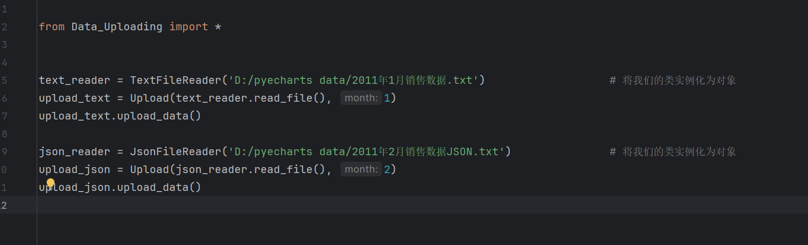
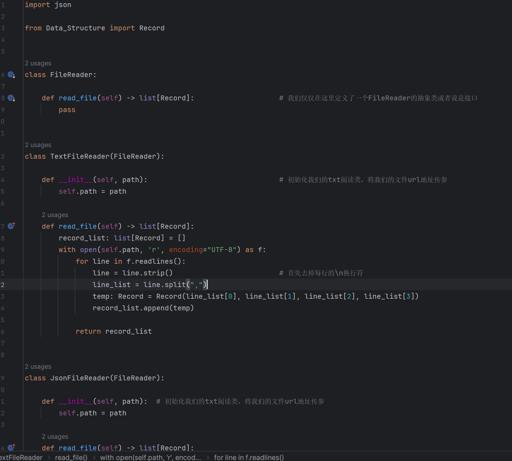
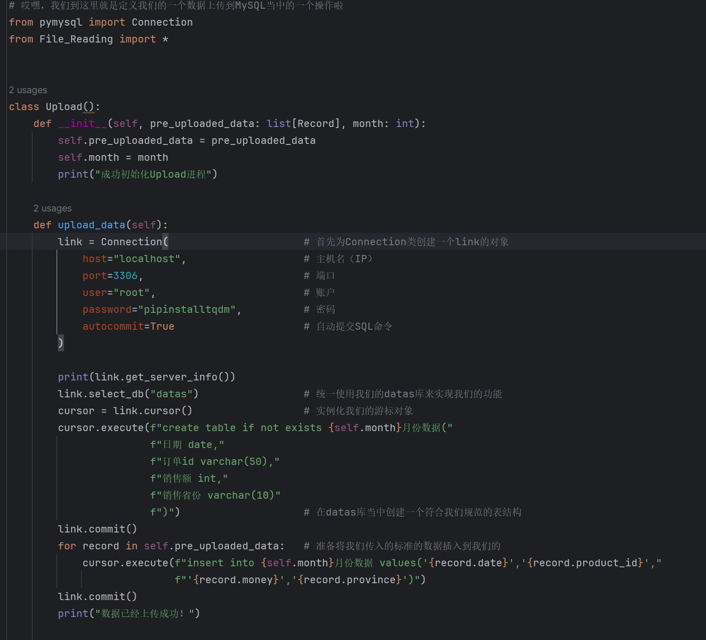
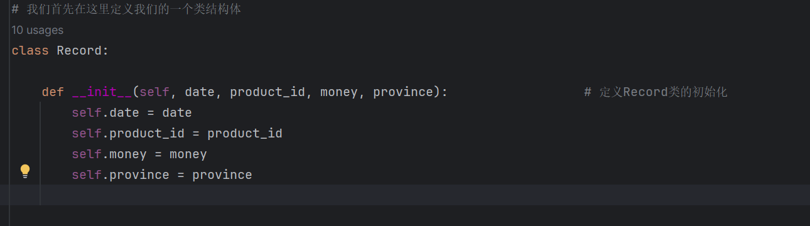
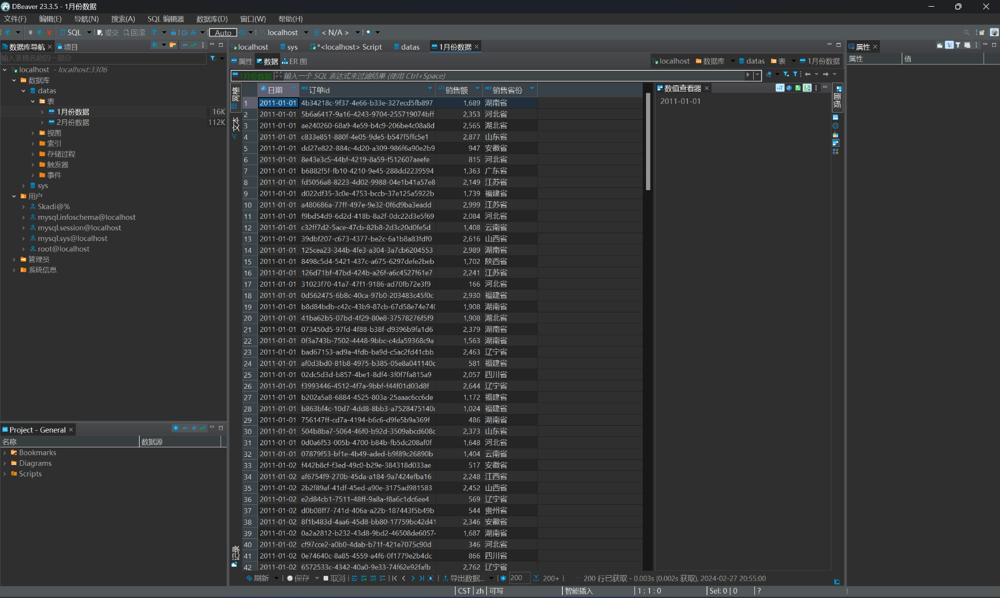

# 简单的PySQL数据处理和上传功能小演示（黑马程序员Python跟练）

## 项目简介

这个项目主要是简单地去实现数据的处理和MySQL数据上传的功能

## 项目功能

项目预计实现的功能：

- 从不同格式的文件中读取数据，并上传到 MySQL 中的一个表中
- 对数据进行分析，生成可视化的图表（待开发）
- 提供一个友好的用户界面，让用户可以方便地操作和查看数据（待开发）

## 项目截图

在这里，您可以插入一些您的项目的截图，来展示您的项目的效果，例如：

## 写在后面

本人纯属Pthon小白，这个小演示只是练手使用，请大佬们多多提点意见
